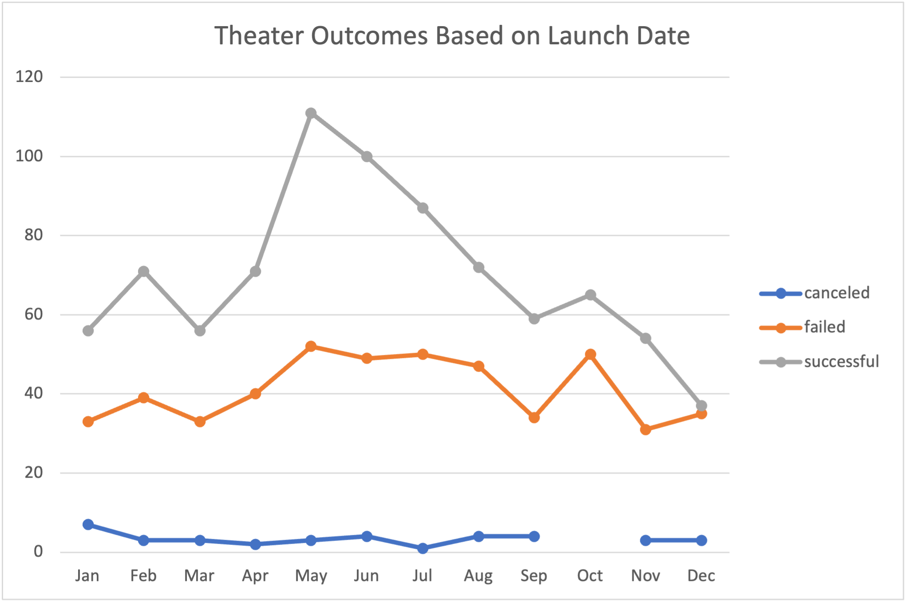
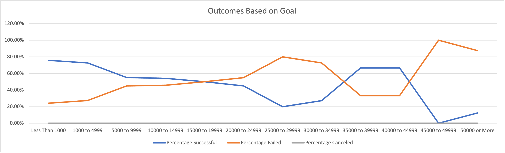

# Challenge 1: Analyzing Similar Kickstarter Campaigns

## Overview
After finding funding via a kickstarter campaign for their new play _Fever_, our client became curious about the results of fundraising campaigns for similar projects compared to when they were launched and what their goal (amount$) was.  Fortunately, Kickstarter keeps records for all campaign results and takes the time to organize by project type and sub-type.  Using this data we were asked to determine the success of similar campaigns and provide our analysis and conclusions.

## Analysis and Challenges

### Analysis of Outcomes Based on Launch Date

To look at how similar campaigns faired over the course of time we decided to investigate the results of similar campaigns by month.  The graph below is the result of this analysis comparing the total number of different results (Successful, Failed, Canceled) within each month for the period of data collected from the category of Theater.

Both the Failed and Successful lines seem to have similar shapes and likewise seem to share many of the same highs and lows in their data.  The total number of Canceled shows on the other hand doesn't show nearly as much of a dramatic change, with the exception of their being no canceled shows during the month of October.  The month with the highest number of successful (and failed) appears to be the month of May with that peak extending from about April to August.  Additionally, there are more subtle peaks for the successful and failed categories in the months of February and October.

### Analysis of Outcomes Based on Monetary Goals

The other factor we were asked to look into was if the inital monetary goal of any kickstarter could be used as an indicator for the success of a fundraiser.  Our next graph below is the result of that investigation, where we filtered for only data concerning the "plays" sub-category and then compared that to the percentage for each category (Successful, Failed, Canceled) that fall in our monetary ranges or buckets (1 successful campaign in a bucket containing only 4 plays would return 25%).  For the purpose of our analysis we primarly used 5000 dollar buckets.

The most obvious takeaway from this graphic is that there were no campaigns of sub-category "plays" that were cancelled for the entirety of the collected data.  Thus the sum of the percentages for Canceled and Successful add to 100% for each of our buckets, or in other words the line graphs mirror one another.  The graphs for Successful and Canceled cross one another 3 times with more Successful outcomes than Canceled for campaigns less than $1000 up to $15000 and then again from around $35000 to about $45000.  In all other ranges the percentage of Canceled campaigns is larger.

### Challenges Encountered

The most significant challenges encountered for me while analyzing the data were both due to the format in which the data was stored.  The most interesting was converting the stored time into a readable format.  Thankfully, Kickstarter opted to use a well recognized format of timestamp called Unix which converts everything into seconds since Midnight of January 1st, 1970.  This provided us with all the information we needed to convert those values in to a readable date.  The second issue encountered was the result of kickstarter opting to use a single column for category and sub-category, making it a bit tricky to filter to the level we wanted.  However Excel happens to have a option called text-to-columns that allowed us to separate these factors into two separate and more useful columns.  Lastly, I wanted to acknowledge that we have not carefully considered potential outliers here, although due to the fairly general scope even a handful of outliers wouldn't significantly impact our findings.  (I realize that we did a box and whisker outlier check in our prep for class however it wasn't mentioned in the deliverables so I am writting this assuming we didn't do that step).

## Results

The fact that the plots of success and fails vs launch date seem to follow a similar pattern is not that out of place.  Since a spike in both essentially indicates that there are more campigns that occur in that month.  But based on our analysis of the data I believe we can say with some confidence that if in the future someone was planning on funding a Theater project using a kickstarter they should definitely consider having the project set to launch sometime from April to August, and even more ideally would be May to July due to the significant spike in the number of Successful campaigns.  Likewise it is recommended that Novemer and in particular December be avoided due to the sharp decline of Successful campaigns.  There may be additional analysis that would be worth looking at for the months of February and October.  These months jump out for opposite reasons where in February there is noticeable spike in Successful campaigns and a less significant spike in Failed campaigns with the opposite occuring in October.  This would indicate that while neither month has the most campaigns attempted, February may see a higher percentage of success than other months and October seeing more failure.  I would recommend as an additional step, to look at and graph months vs percentage instead of just sum total.

Regarding our analysis vs Goals, it would appear that smaller fundraisers (less than $15000) and then fundraisers in the range of $35000 to $45000 would be the most ideal goals to aim for.  Outside of these ranges the likelihood of a campaign failing is definitely higher.

Some limitations of the dataset would include things like a more defined location of the project/campaign and another one might be an additional easily filterable column for genre.  Just to clarify, a play debuting in Pella, Iowa may have a different level of success compared to a similar play debuting on Broadway.  Likewise, different genres may find different success, meaning an opera may have wildly different results from a play meant for children not to mention a different budget/goal.
